# 🏘️ Sistem Manajemen RT

Aplikasi web untuk mengelola administrasi RT perumahan elite, mencakup manajemen penghuni, rumah, iuran bulanan, pengeluaran, dan laporan keuangan.

> **Skill Fit Test — Full Stack Programmer**
> Stack: Laravel 10 · React 18 · MySQL 8 · Laravel Sanctum

---

## 📋 Fitur Utama

### 🏠 Manajemen Rumah
- Daftar 20 rumah dengan filter status (dihuni/kosong) dan tipe (tetap/kontrak)
- Detail rumah: penghuni aktif, riwayat penghuni, riwayat pembayaran
- Daftarkan penghuni ke rumah dengan deteksi tipe otomatis
- Lepas penghuni dari rumah dengan pencatatan tanggal selesai
- Durasi kontrak otomatis menghitung tanggal berakhir

### 👥 Manajemen Penghuni
- Tambah, edit, dan nonaktifkan data penghuni
- Upload foto KTP (JPG/PNG, maks. 2MB)
- Pilih rumah langsung saat tambah penghuni (opsional)
- Riwayat rumah yang pernah dihuni per penghuni
- Soft delete — data tidak hilang permanen

### 💰 Manajemen Pembayaran
- Generate tagihan bulanan otomatis untuk semua penghuni aktif (idempotent)
- Input pembayaran manual dengan dukungan bayar sekaligus beberapa bulan
- Tandai tagihan sebagai lunas dengan satu klik
- Filter tagihan per bulan, tahun, dan status
- Rekapitulasi lunas vs belum lunas per periode

### 📤 Manajemen Pengeluaran
- Catat pengeluaran RT per kategori (gaji satpam, token listrik, perbaikan, dll)
- Filter pengeluaran per bulan, tahun, dan kategori
- Tandai pengeluaran berulang (recurring)

### 📊 Laporan & Dashboard
- Dashboard real-time: statistik rumah, penghuni, dan keuangan bulan berjalan
- Grafik pemasukan vs pengeluaran 12 bulan (bar chart)
- Laporan detail per bulan: semua transaksi masuk dan keluar
- Daftar tunggakan: penghuni yang belum bayar lengkap dengan nominal
- Ringkasan saldo tahunan

---

## 📸 Screenshots

### Dashboard
**Ringkasan visual kondisi RT terkini.** Menampilkan statistik kunci seperti jumlah penghuni, total pemasukan, dan saldo kas bulan ini.
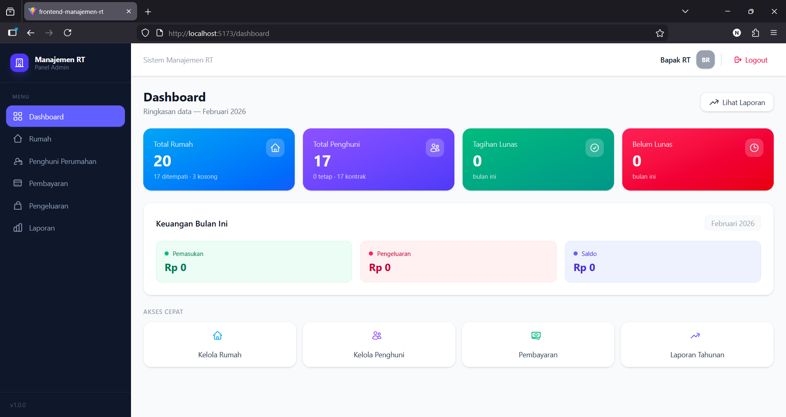

### Manajemen Rumah
| List Rumah | Detail Rumah |
|---|---|
| 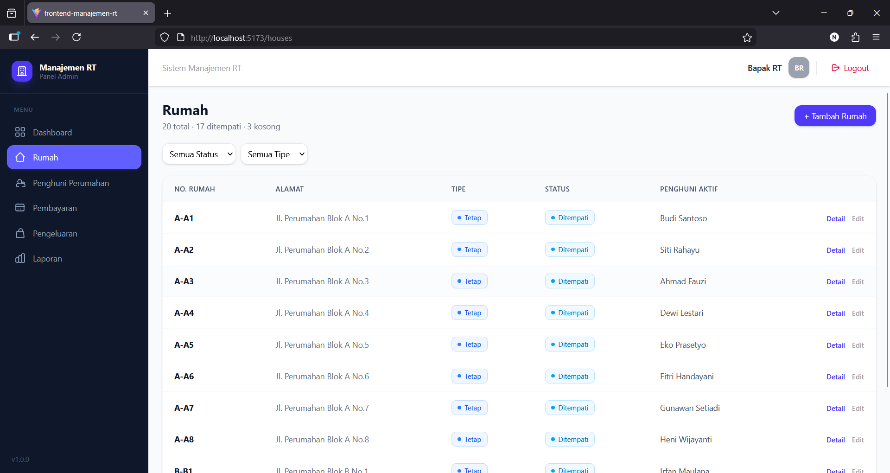 <br> *Melihat semua rumah dengan status hunian (dihuni/kosong) dan tipe (tetap/kontrakan).* | 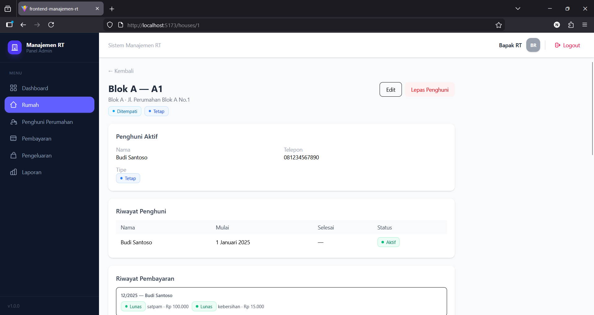 <br> *Menampilkan informasi lengkap rumah, termasuk penghuni aktif, riwayat penghuni, dan histori pembayaran iuran.* |

### Menambah Penghuni ke Rumah
**Proses administrasi hunian.** Memungkinkan pendaftaran penghuni baru langsung ke rumah yang dipilih, dengan pencatatan tanggal mulai huni.
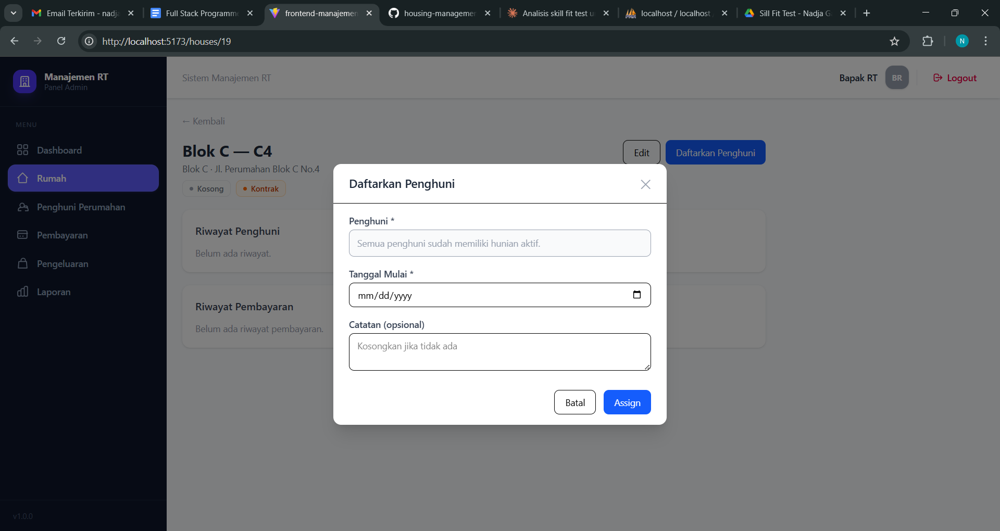

### Manajemen Penghuni
| List Penghuni | Form Tambah Penghuni |
|---|---|
| 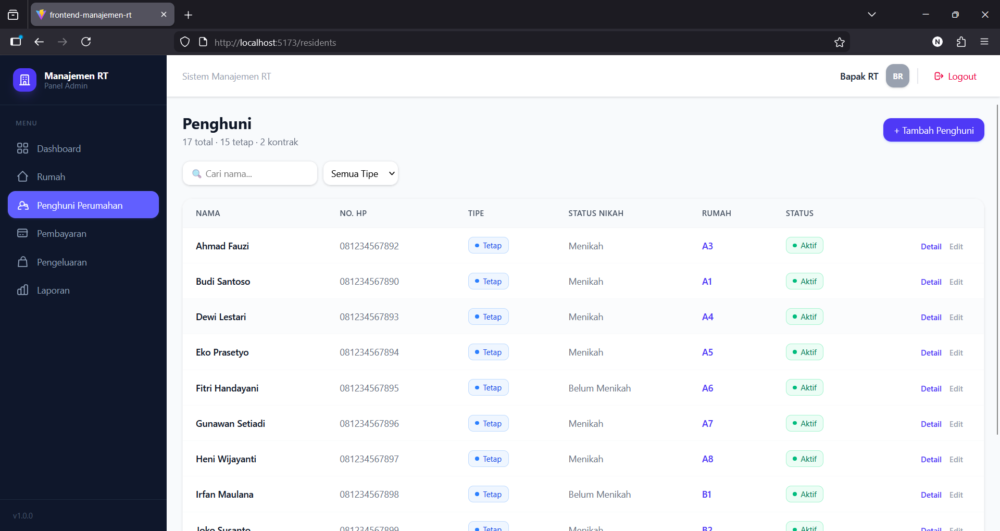 <br> *Daftar semua penghuni yang terdaftar, baik aktif maupun non-aktif.* | 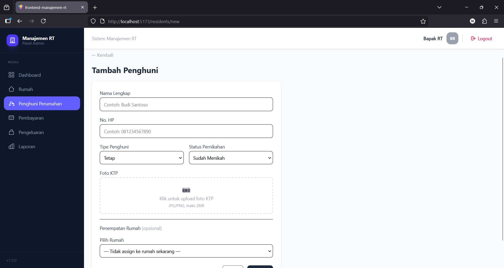 <br> *Formulir untuk menambah data penghuni baru, termasuk upload foto KTP dan penentuan status kontrak.* | 
| Detail Penghuni |
| 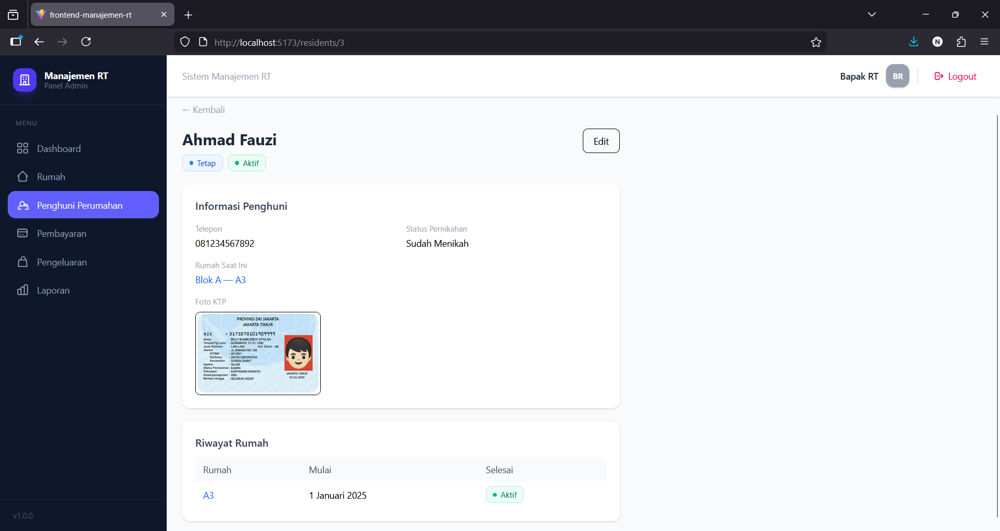 <br> *Informasi detail seorang penghuni, mencakup data pribadi dan riwayat tempat tinggal.* |

### Pembayaran Iuran
**Mengelola arus kas dari iuran warga.**
| List Tagihan | Form Pembayaran Manual |
|---|---|
| 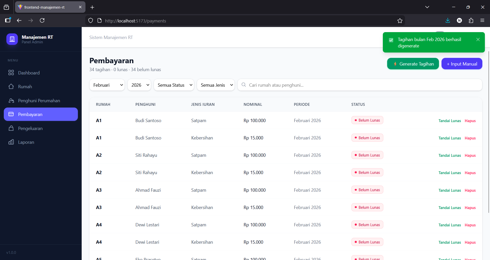 <br> *Memonitor semua tagihan iuran warga, dengan filter berdasarkan bulan, tahun, dan status bayar.* | 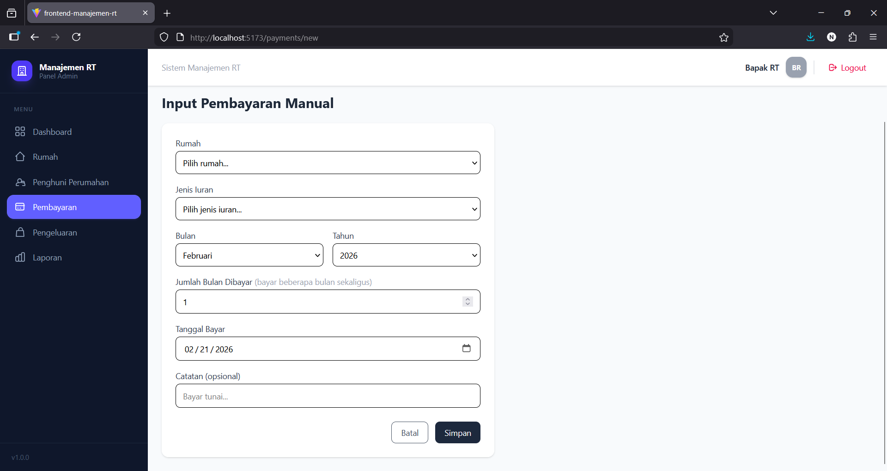 <br> *Fasilitas untuk mencatat pembayaran iuran secara manual, mendukung pembayaran untuk beberapa bulan sekaligus.* |

### Pengeluaran
**Transparansi pengelolaan dana RT.**
| List Pengeluaran | Form Tambah Pengeluaran |
|---|---|
| 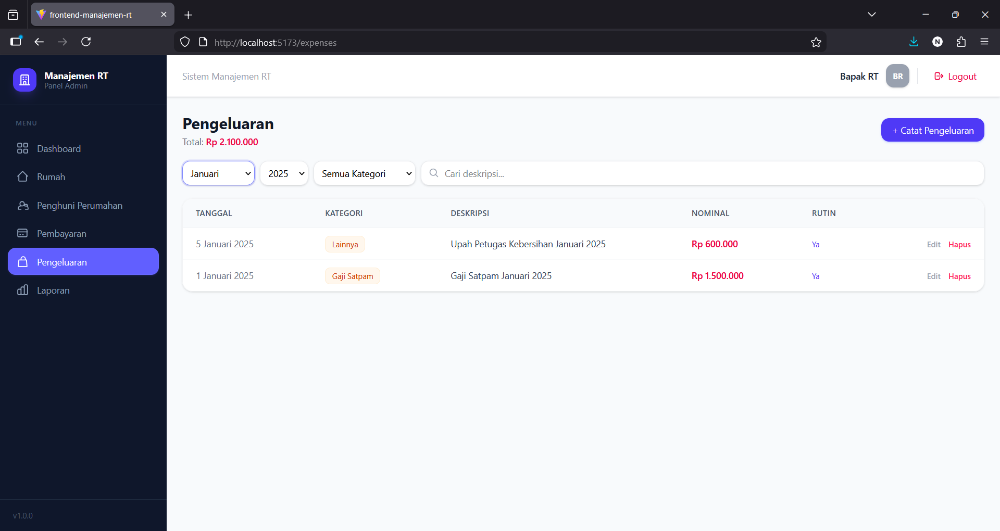 <br> *Mencatat dan menampilkan semua pengeluaran yang dilakukan oleh RT.* | 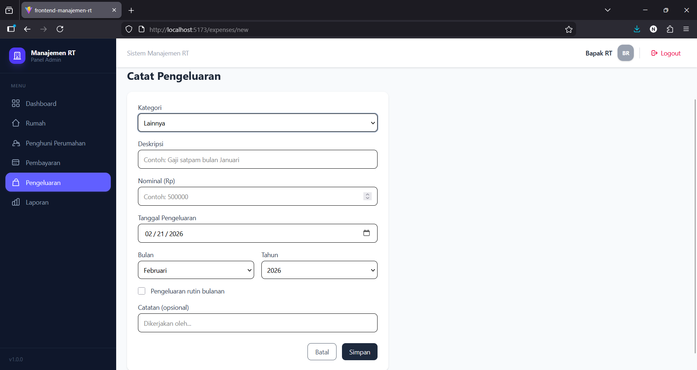 <br> *Formulir untuk menambah data pengeluaran baru, lengkap dengan kategori dan keterangan.* |

### Laporan Keuangan
**Rekapitulasi dan analisis keuangan RT.**
| Grafik Tahunan | Bulanan |
|---|---|
| 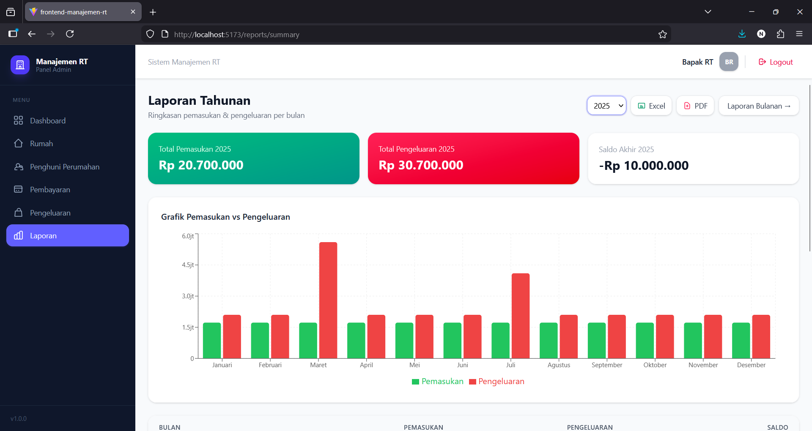 <br> *Ringkasan pendapatan, pengeluaran, dan saldo selama satu tahun dalam bentuk tabel dan grafik.* | 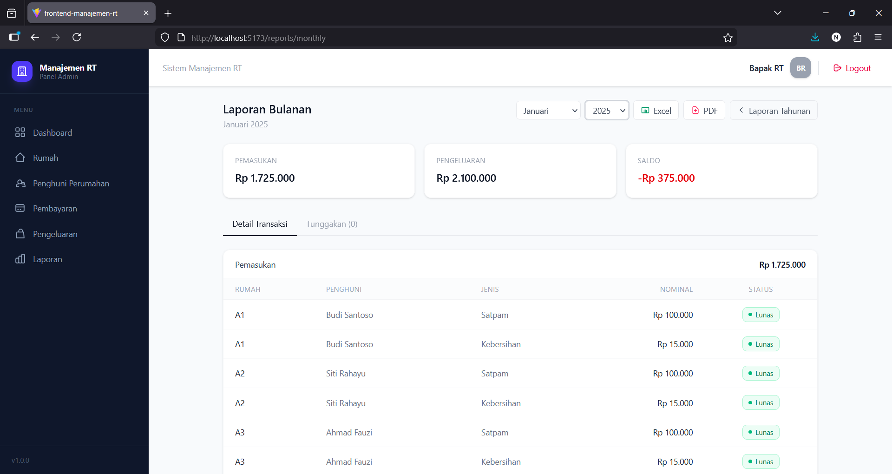 <br> *Laporan detail transaksi bulanan, mencakup daftar pemasukan, pengeluaran, dan tunggakan iuran.* |

---

## 🛠️ Tech Stack

| Layer | Teknologi |
|---|---|
| Backend | Laravel 10, PHP 8.2+ |
| Frontend | React 18, Vite, Tailwind CSS v4 |
| Database | MySQL 8.0 |
| Auth | Laravel Sanctum (Bearer Token) |
| State Management | Zustand |
| Grafik | Recharts |
| HTTP Client | Axios |

---

## 📁 Struktur Project

```
rt-management/
├── backend/            ← Laravel 10 API
├── frontend/           ← React 18 + Vite
├── docs/
│   └── screenshots/    ← Screenshot per fitur
└── README.md
```

---

## ⚙️ Instalasi & Menjalankan Project

### Prasyarat
- PHP 8.2+
- Composer 2.x
- Node.js 22 LTS
- MySQL 8.0+

---

### 🔧 Backend (Laravel)

```bash
# 1. Masuk ke folder backend
cd backend

# 2. Install dependencies
composer install

# 3. Salin file environment
cp .env.example .env

# 4. Generate application key
php artisan key:generate
```

**4. Konfigurasi `.env`** — sesuaikan kredensial database:
```env
DB_CONNECTION=mysql
DB_HOST=127.0.0.1
DB_PORT=3306
DB_DATABASE=rt_management
DB_USERNAME=root
DB_PASSWORD=your_password
```

```bash
# 5. Buat database di MySQL
# Jalankan di phpMyAdmin atau MySQL CLI:
# CREATE DATABASE rt_management;

# 6. Jalankan migrasi dan seeder
php artisan migrate --seed

# 7. Buat symbolic link untuk storage
php artisan storage:link

# 8. Jalankan server
php artisan serve
```

Backend berjalan di: `http://localhost:8000`

---

### 🎨 Frontend (React)

```bash
# 1. Masuk ke folder frontend
cd frontend

# 2. Install dependencies
npm install

# 3. Salin file environment
cp .env.example .env
```

**3. Konfigurasi `.env`:**
```env
VITE_API_URL=http://localhost:8000
```

```bash
# 4. Jalankan dev server
npm run dev
```

Frontend berjalan di: `http://localhost:5173`

---

### 🔑 Akun Default

Setelah menjalankan seeder, gunakan akun berikut untuk login:

| Field | Value |
|---|---|
| Email | admin@rt.com |
| Password | password |

---

## 🗄️ Struktur Database

| Tabel | Deskripsi |
|---|---|
| `users` | Akun admin aplikasi |
| `houses` | Data 20 rumah perumahan |
| `residents` | Data penghuni (soft delete) |
| `house_residents` | Relasi & riwayat hunian per rumah |
| `payment_types` | Jenis iuran (satpam, kebersihan) |
| `payments` | Tagihan dan pembayaran iuran |
| `expenses` | Pengeluaran kas RT |

### Entity Relationship Diagram (ERD)
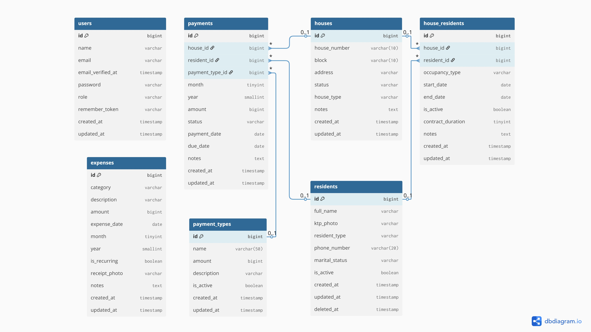

---

## 🔗 API Endpoints

Base URL: `http://localhost:8000/api/v1`

| Method | Endpoint | Deskripsi |
|---|---|---|
| POST | `/auth/login` | Login admin |
| POST | `/auth/logout` | Logout |
| GET | `/houses` | Daftar rumah |
| GET | `/residents` | Daftar penghuni |
| GET | `/payments` | Daftar tagihan |
| POST | `/payments/generate-monthly` | Generate tagihan bulanan |
| GET | `/expenses` | Daftar pengeluaran |
| GET | `/reports/dashboard` | Data dashboard |
| GET | `/reports/summary` | Laporan tahunan |
| GET | `/reports/unpaid` | Daftar tunggakan |

> Dokumentasi lengkap 33 endpoint tersedia di folder `backend/docs/` atau file `api_endpoints_rt.md`.

---

## 🔧 Perintah Berguna

```bash
# Reset database dan jalankan ulang seeder
php artisan migrate:fresh --seed

# Clear semua cache
php artisan optimize:clear

# Cek semua route terdaftar
php artisan route:list

# Build frontend untuk production
npm run build
```

---

## ⚠️ Troubleshooting

**Foto KTP tidak muncul**
```bash
php artisan storage:link
```

**CORS error di frontend**
Pastikan `APP_URL` di `.env` backend sudah benar dan jalankan:
```bash
php artisan config:clear
```

**Migration gagal**
Pastikan database `rt_management` sudah dibuat dan kredensial di `.env` sudah benar.

**Port frontend berubah-ubah**
Tambahkan konfigurasi di `vite.config.js`:
```js
server: { port: 5173, strictPort: true }
```